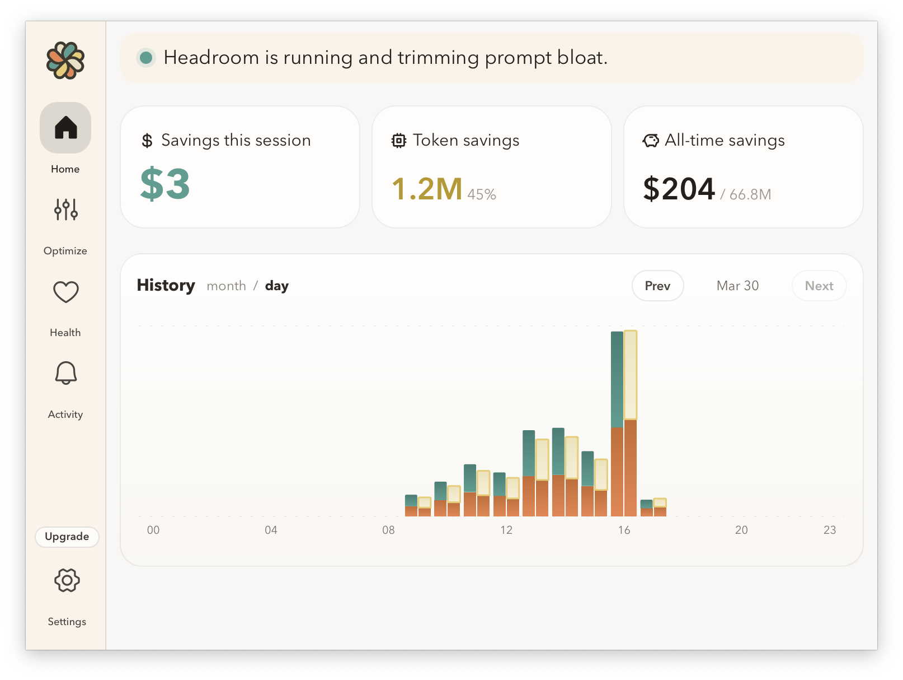

# Headroom Desktop

**Cut your LLM API bills by 60–90% without changing how you code.**

[](https://extraheadroom.com)&nbsp;&nbsp;[](https://github.com/gglucass/headroom-desktop/releases/latest)

> **Requires macOS on Apple Silicon (M1 or later)**

### Install

1. Go to the [latest release](https://github.com/gglucass/headroom-desktop/releases/latest)
2. Download the `.dmg` file (e.g. `Headroom_0.2.9.dmg`)
3. Open the DMG, drag **Headroom** to Applications
4. Launch Headroom — it appears in your menu bar and walks you through setup

Headroom is signed and notarized, so macOS will open it without Gatekeeper warnings.

---



---

> **Note:** Headroom currently supports **Claude Code** only. Support for additional clients is planned.

Headroom is a local-first macOS tray app that routes your coding clients through a local optimization pipeline. It installs and manages a self-contained Python runtime, bundles proven token-saving tools, and surfaces savings analytics — all without touching your system environment.

## How it works

Headroom sits in your menu bar and does three things:

1. **Installs a managed Python runtime** into Headroom-owned storage — isolated from your system Python, no `pip install --user` pollution.
2. **Chains token-saving tools** (`headroom` for prompt optimization, `rtk` for CLI output compression) between your client and the LLM API.
3. **Shows you the math** — daily and monthly savings charts, per-client token stats, and pipeline health.

The app ships as a slim Tauri shell (~a few MB). Heavy Python components are fetched on first launch and kept in `~/Library/Application Support/Headroom`.

## Bundled tools

| Tool | What it does | Default |
|------|-------------|---------|
| [headroom](https://pypi.org/project/headroom-ai/) | Prompt optimization pipeline (Python) | Required |
| [rtk](https://github.com/gglucass/rtk) | Rewrites Claude Code bash commands to strip noise before it reaches the context window | Auto-enabled |
| vitals | Project health scanner — flags stale deps, large files, drift | Included |

**Tool inclusion policy:** only tools that run entirely locally, inside Headroom-managed storage, with a stable CLI surface make it in. No cloud dependencies, no host profile mutations. See [`research/tool-compatibility-matrix.md`](research/tool-compatibility-matrix.md).

## Compression benchmarks

Numbers from the [headroom](https://github.com/chopratejas/headroom) open-source library that powers the optimization pipeline, summarized from the current published benchmarks page.

### Current benchmark summary

| Benchmark | What it tests | Result |
|-----------|---------------|--------|
| Scrapinghub article extraction | Extract article bodies from 181 HTML pages while removing boilerplate | 0.919 F1, 98.2% recall, **94.9% compression** |
| SmartCrusher JSON compression | Find a critical error in 100 production log entries after compression | 4/4 correct, **87.6% compression** |
| QA accuracy preservation | Ask the same questions on raw HTML vs. extracted content | 0.87 F1 vs. 0.85 baseline, 62% exact match vs. 60% |
| Multi-tool agent test | 4-tool agent investigating a memory leak with compressed tool output | 6,100 vs. 15,662 tokens sent, **76.3% compression**, same findings |

### Benchmark details

| Benchmark | Setup | Accuracy | Compression |
|-----------|-------|----------|-------------|
| HTML extraction | Scrapinghub article extraction benchmark, 181 pages | 0.919 F1, 0.879 precision, 0.982 recall | 94.9% |
| JSON compression | 100 production log entries, critical error at position 67 | 4/4 correct answers | 87.6% |
| QA preservation | SQuAD v2 + HotpotQA on raw HTML vs. extracted content | +0.02 F1, +2% exact match vs. raw HTML | — |
| Multi-tool agent test | Agno agent with 4 tools investigating a memory leak | Same findings as baseline | 76.3% |

### What compresses well vs. what doesn't

| Content type | Typical savings | Notes |
|-------------|-----------------|-------|
| JSON arrays (search results, API responses, DB rows) | 86–100% | Primary use case |
| Structured logs | 82–95% | Errors and anomalies always preserved |
| Agentic conversations (25–50 turns) | 56–81% | |
| Plain text / documentation | 43–46% | Cost savings only, adds latency |
| Source code | Mostly passthrough | Code in active messages is protected by default — see limitations |

### Limitations worth knowing

- **Code compression is intentionally conservative.** Code in recent messages (last 4 by default) and any conversation where the user is asking about code (`analyze`, `debug`, `fix`, etc.) is never compressed. The savings from code come from dropping old, no-longer-relevant messages — not from stripping function bodies.
- **Short content is skipped.** Arrays under 5 items and content under 200 tokens pass through unchanged.
- **Text compression (LLMLingua) adds latency.** It requires a ~2 GB model download on first use and doesn't break even on fast models. Useful for cost reduction, not speed.
- **Plain-text RAG results pass through.** Compression targets tool outputs and JSON; plain text in user messages is not compressed.

Full methodology and reproducible benchmarks: [chopratejas/headroom benchmarks](https://chopratejas.github.io/headroom/benchmarks/) · [limitations](https://chopratejas.github.io/headroom/LIMITATIONS/)

## Interesting design decisions

- **Zero host pollution.** Headroom owns its entire dependency tree. Uninstalling the app leaves your shell, your Python, and your PATH exactly as they were (except for the optional `rtk` PATH addition, which is reversible).
- **Rust shell, Python brain.** The Tauri/Rust layer handles tray lifecycle, managed installs, client detection, and update delivery. The optimization work happens in Python, where the headroom ecosystem lives.
- **Client config with rollback.** When Headroom edits a supported client's config (e.g. Claude Code settings), it writes a backup first. Disabling or uninstalling restores the original.
- **Open source shell, private web.** The desktop app is MIT-licensed and open source. The marketing site and account backend live in a separate private repo — so contributors can build and run the full desktop experience without needing backend access.

## Project structure

```
src/              React + Tauri frontend (tray UI, onboarding, savings dashboard)
src-tauri/        Rust backend
  state.rs        Dashboard state and data shaping
  tool_manager.rs Bootstrap, Python runtime, and tool installation
  client_adapters.rs  Client detection and guided setup
  insights.rs     Daily local recommendation engine
research/         Tool vetting artifacts and compatibility matrix
docs/             Architecture notes, release process
```

## macOS release flow

Updates ship outside the App Store via Tauri's built-in updater. The app polls GitHub Releases in the background, prompts before installing, and requests a restart to finish. Both local DMG builds and the GitHub Actions workflow run `./scripts/verify-release.sh` — a failing test blocks the build before anything is published.

See [`docs/macos-release.md`](docs/macos-release.md) for the full release setup.

## Development

```bash
npm install
npm run tauri dev
```

For the live auth and pricing flow, create a `.env`:

```bash
HEADROOM_ACCOUNT_API_BASE_URL="https://extraheadroom.com/api/v1"
HEADROOM_APTABASE_APP_KEY="REPLACE_WITH_APTABASE_APP_KEY"
VITE_HEADROOM_POLAR_PRO_CHECKOUT_URL="https://polar.sh/your-organization/checkout?products=your-pro-product"
VITE_HEADROOM_POLAR_MAX5X_CHECKOUT_URL="https://polar.sh/your-organization/checkout?products=your-max5x-product"
VITE_HEADROOM_POLAR_MAX20X_CHECKOUT_URL="https://polar.sh/your-organization/checkout?products=your-max20x-product"
VITE_HEADROOM_SALES_CONTACT_URL="mailto:hello@extraheadroom.com"
VITE_HEADROOM_CONTACT_FORM_URL="https://extraheadroom.com/contact_request"
```

Set the same keys as GitHub Actions repository variables for production DMG builds.

Run tests:

```bash
npm run test:all          # frontend + Rust
cargo test --manifest-path src-tauri/Cargo.toml   # Rust only
```

## Dependency pinning

`headroom-ai[all]==0.5.18` is the current pinned PyPI version. Before each app release, validate against the latest published headroom version and bump the pin deliberately.
